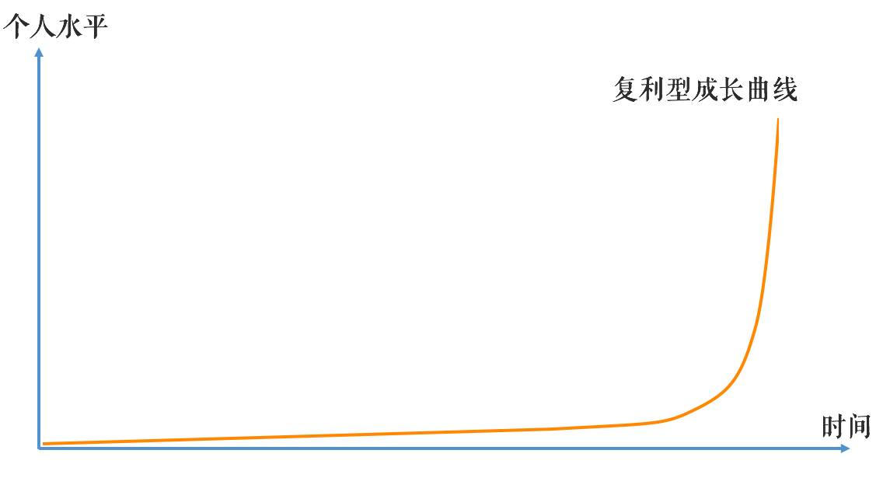

###引言：谁说时间被打成碎片，就不能高效学习了？
####1.问题导向：对碎片学习价值的重新认识。
####2.认知拉升：
①系统化是由碎片化而逐渐形成的。如果你不掌握碎片化的学习，就不能掌握系统化的能力。
②90%的时间和精力投在深层、底层的知识学习上，两者结合在一起，学习系统可以自生长，具有复利效应！

3.关键概念：认知偏差、利用碎片
4.方法流程： 
**What**：体察情绪的偏见，抛弃非A即B的观念。
**Why**：各种比较和选择并非绝对，都有各自适应的场景和目的。在当今碎片化的趋势下，先充分利用碎片时间，再逐步积累碎片，扩展、联系、形成系统更符合当下场景。
**How**：深层+底层，即把90%的时间用在深层学习底层规律上，把握通用规律，建立丰富心理表征，以看清投影世界运转本质。

